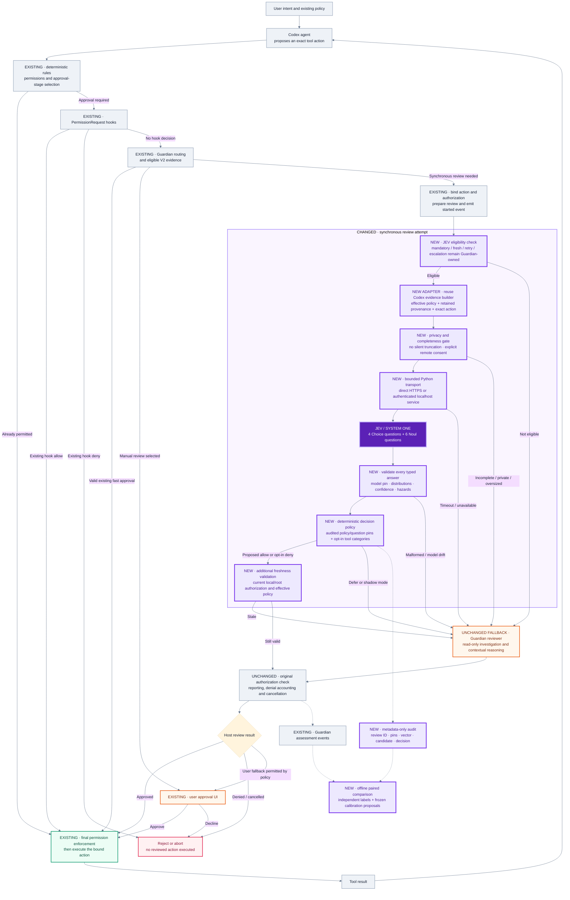

# Complete architecture: JEV as a Codex approval preflight

## 1. Objective and design boundary

Introduce a fast, structured classifier ahead of the expensive **eligible synchronous Guardian model attempt**, without replacing the rest of Codex's security system. The intended benefit is fewer generative-review invocations for clearly supported cases. This is a performance hypothesis until measured on the same real workload and security criteria.

This package does not change existing deterministic auto-approvals, existing Guardian V2 evidence reuse, the sandbox, administrator constraints, model-required reviews, or the user's selected permission profile. A JEV classification is evidence for a review result; it is never an instruction to execute a command.

The source inspection is pinned to `openai/codex` commit `c45ea25ffb72d5f7324489d824d0c677283aa0b4`, not an unqualified claim about every installed Codex release. Relevant source locations are listed in [SOURCES.md](docs/SOURCES.md), especially S5–S10.

## 2. What changed from the preliminary sketch

The earlier diagram identified `ApprovalReviewContributor` as a possible extension point. Inspection shows a better fit for this bounded implementation: `ReviewHost::attempt` inside the existing synchronous reviewer. In the inspected source, `ApprovalDecision::Allow` has cached-evidence semantics, while the surrounding router separately handles mandatory and fresh review. Returning `Reviewed(Approved)` directly from a new contributor would require carefully recreating host validation and reporting responsibilities. This package does not take that shortcut. [S5, S6]

Other corrections are significant. Existing hooks can decide before Guardian, so the packaged hook cannot be treated as equivalent to the native boundary. Existing fast approvals should not become slower by adding an API request. A failure must defer to the existing route rather than always open a human prompt. Model confidence must be distinguished from empirically measured error rates. No claim is made that this package already proves JEV faster or safer.

## 3. Architecture and change emphasis

**Purple** is new implementation. **Slate** is existing Codex behavior. **Orange** is the preserved contextual/human fallback. **Green** is existing enforcement. The diagram describes control-flow responsibilities, not every internal Codex function call.



The Mermaid file is also available as `docs/diagrams/approval-flow.mmd`. The sequence and deployment diagrams document timing and trust boundaries separately.

## 4. Terminology

**TypeSafe** is the API/product provider. **System One** is its structured-decision interface and model category. **JEV** is the model selected in the request. The documented interface accepts a state and typed questions, returning structured answers. This implementation uses four `Choice` questions and six `Noul` questions in one request. [S1, S2]

**Codex agent** means the agent proposing work. **Guardian** means Codex's existing automatic reviewer. **Preflight engine** means this package's deterministic validation and routing around JEV. **Candidate** means the model-derived gate result before rollout restrictions. **Decision** means what the local engine proposes to the native host after rollout checks; it still does not prove that Codex accepted or executed it.

## 5. Unchanged authority and flow

Codex first determines which actions require review. Requests already permitted by deterministic policy do not reach this preflight. Existing hooks retain their precedence. Existing Guardian V2 behavior also remains before the synchronous fallback. Requests needing a synchronous attempt pass through the normal captured-action preparation and review-start reporting. [S5–S8]

The new native module is consulted only inside that attempt. A valid JEV result becomes a `GuardianAssessment` and then passes through the original host validation, reporting and denial-accounting code. If JEV abstains, times out, fails validation, or returns a now-stale result, the original Guardian inference call runs under the original overall review deadline. The overall deadline is not reset to hide preflight latency.

This architecture deliberately retains layered checks. A low-risk answer cannot manufacture credentials, expand a network allowlist, change the permission profile, or execute the proposed tool. The implementation never calls a subprocess with the proposed action; its only subprocess is the fixed, operator-selected Python adapter.

## 6. Native integration surface

The guarded source installer performs three changes:

| File | Change |
|---|---|
| `codex-rs/core/src/guardian/mod.rs` | Register private `jev` module |
| `codex-rs/core/src/guardian/review_request.rs` | Retain the existing review ID and consult JEV before the existing inference call |
| `codex-rs/core/src/guardian/jev.rs` | New bounded evidence/transport adapter and extra freshness checks |

The adapter calls existing Codex functions for the rendered effective Guardian instructions, structured action serialization, and provenance-bearing retained review context. It does not scrape the ordinary chat transcript from disk, invent authorization from agent prose, or maintain a duplicate generic Guardian policy. The exact source APIs and their ownership are recorded in S7–S10.

The v0.1 eligibility boundary is intentionally narrower than the complete list of possible tool actions. Only non-escalated `exec_command` and `apply_patch` requests can enter JEV. Mandatory/fresh review, retry, network access, permission expansion, stdin, Unix interception, and MCP/computer-use requests retain their existing reviewer. Broadening this boundary requires its own implementation review and evaluation, not merely a prompt change.

## 7. Request envelope

The native host creates a versioned envelope:

```json
{
  "schema_version": 1,
  "request_id": "the-existing-guardian-review-id",
  "source": "codex-native",
  "action": {"tool": "exec_command", "command": ["pwd"]},
  "context": {
    "policy": {"guardian_instructions": "effective Codex-selected instructions"},
    "messages": [],
    "authorization_revision": "host-local-and-root-evidence-version"
  },
  "guards": {
    "context_complete": true,
    "mandatory_review": false,
    "fresh_review": false,
    "retry": false,
    "escalated": false,
    "cancelled": false,
    "authorization_current": true
  }
}
```

This abbreviated shape is explanatory; `examples/envelope.json` is a complete synthetic example. In native operation the messages come from Codex's context composer, not from this example.

The envelope is a trusted-host protocol. Its `source` string and boolean fields are not cryptographic attestations. The security assumption is that the operator controls the launcher, configuration, and service token and the coding agent cannot tamper with them. A process running with equivalent host authority could forge such input; the package is not a same-user isolation system.

## 8. Context construction and budgets

The host obtains local and root authorization versions, checks their retained-context completeness, resolves effective reviewer instructions, and asks Codex's existing composer for the retained review evidence in full mode. Any reported truncation causes abstention. Media is not silently stripped to make a text-only model input appear complete.

The Python engine applies a separate serialized-state byte limit, defaulting to 24,000 bytes. This is an engineering cap, not an assertion about exact JEV tokenization. Large or unsupported input is deferred intact to the existing reviewer rather than pruned and approved using a lossy summary. The model's documented token limits and text-only boundary are distinct from this local byte cap. [S3]

“Complete” here means the host's retained authorization evidence passed the available completeness checks. It is not a proof that the transcript contains every historical fact or that software behavior can be fully inferred without investigation. The `evidence` question explicitly provides a further route for cases needing file reads or target resolution.

## 9. Atomic question set

Every question repeats the trust boundary and refers directly to the same state. No question assumes the answer to another question, and no opaque numeric code replaces the action's security-relevant meaning.

| Question | Primitive | Role |
|---|---|---|
| `risk` | Choice | Intrinsic low/medium/high/critical/unknown risk |
| `authorization` | Choice | Explicit, within-task, absent or unknown authorization |
| `evidence` | Choice | Sufficient, needs investigation or unreliable evidence |
| `compliance` | Choice | Compliant, violation or uncertain under supplied policy |
| `destructive` | Noul | Irreversible-loss hazard |
| `sensitive_egress` | Noul | Sensitive or derived-data disclosure |
| `credential_probing` | Noul | Credentials from unintended sources |
| `persistent_weakening` | Noul | Persistent security-boundary weakening |
| `scope_excess` | Noul | Scope beyond trusted authorization |
| `prompt_injection` | Noul | Untrusted instructions steering the proposed action |

The API shape and full rubrics are implemented in `questions.py` and exported in `examples/typesafe-request.json`. Question-map IDs identify results; all semantic instructions are written explicitly in each question. [S2]

## 10. Typed answer validation

The engine requires the exact pinned model ID, every expected answer, each expected primitive, every defined Choice label, finite in-range numeric values, approximately normalized distributions, selected-label consistency with the maximum probability, and valid usage counters. Duplicate JSON keys, `NaN`, missing confidence, unknown labels and malformed responses cause abstention.

Choice confidence is retained as a separate signal from the selected option probability. Noul answers have no separate confidence field; the package does not invent one. Neither field is treated as an empirical guarantee of safe approval. Thresholds need workload-specific evaluation. [S2, S4]

## 11. Deterministic decision policy

A proposed fast allow requires all of the following: low intrinsic risk; explicit or within-task trusted authorization; sufficient evidence; policy compliance; configured confidence and option-probability floors for all Choice outputs; every hazard below its configured ceiling; and an explicitly enabled tool category.

A proposed deny is different. High risk alone is not a policy violation. Fast denial is disabled by default and requires a sufficiently confident, sufficiently probable `violation` judgment with adequate evidence. All other cases defer.

Rollout controls are then applied. Only native envelopes can become enforced decisions. The effective policy hash must be approved, the entire fixed question set hash must match the approved hash, and mode must be `enforce`. Shadow mode always defers regardless of candidate quality. Failure to append the required audit record also removes permission to issue a fast result.

The values in the sample configuration are starting hypotheses, not validated deployment thresholds. Changing model version, policy, question wording, action scope or input distribution requires new evaluation.

## 12. Transport options and secrets

The direct path launches an absolute Python interpreter with `-I` and an absolute package launcher, avoiding imports from the target repository. The provider uses the documented HTTPS endpoint, bearer authentication, response-size bounds, no redirects, and no ambient proxy configuration. Automatic retries are intentionally absent on this latency-sensitive path; a rate limit or provider failure leads to the existing reviewer. [S2]

The optional daemon binds only to `127.0.0.1`, requires a high-entropy bearer token, bounds request-handler concurrency, and shares an in-memory circuit breaker. It can hold `TYPESAFE_API_KEY` in a service environment separate from the agent process. The native bridge still launches a small Python client per request; this package does not claim zero subprocess overhead or a pooled persistent provider connection.

A localhost daemon is not a local JEV inference server. Raw eligible context crosses to TypeSafe only after explicit operator consent. The included secret-pattern filter catches some literal credentials and refuses submission; it is not a comprehensive data-loss-prevention system and cannot establish legal or organizational approval for external processing.

## 13. Freshness, cancellation and action binding

The same immutable native request is used for both the proposed review and the eventual host result. Request IDs bind transport responses to the pending Guardian review. Snapshot hashes bind Python/daemon records to the complete envelope, including policy, action and authorization revision. No new cross-request permission cache is introduced.

After a JEV decision returns, the native module compares current local and root authorization versions and effective policy against the captured values, then rechecks mandatory-review requirements and cancellation. The original Codex stale-authorization check remains after this extra check. History reset/cancellation propagates through the existing host path. The subprocess is kill-on-drop and the preflight is bounded by the smaller of two seconds and the existing Guardian deadline.

These controls do not eliminate every filesystem time-of-check/time-of-use problem. A mutable script or symlink may change without a user-authorization revision. Cases requiring stronger executable-content or target attestation should defer; this package does not claim complete behavior proofs for arbitrary shell programs.

## 14. Failure semantics

| Condition | Behavior |
|---|---|
| Integration environment unset | Original Guardian path, no adapter process |
| Off mode or remote consent absent | No TypeSafe submission; defer |
| Mandatory/fresh/retry/escalation | Existing reviewer, no JEV substitution |
| Too much or unsupported context | Defer without silent truncation |
| Detected possible literal secret | No remote submission; defer |
| HTTP error, timeout or malformed answer | Defer; update circuit-breaker state |
| Model or policy/question drift | No enforced JEV decision |
| Audit failure | Defer when audit is required |
| Authorization/policy changes during review | Reject stale JEV result and retain original route |
| Guardian subsequently fails | Original Codex failure/user policy, not a newly invented fallback |

“Fail closed” means the new component never grants permission on its own failure. It does **not** mean the action is globally denied: an existing Guardian review or allowed user interaction may still legitimately approve it.

## 15. Hook compatibility is not native equivalence

The optional hook installer creates a `PermissionRequest` hook that always abstains and can record limited metadata. Hook inputs do not expose the complete native managed-policy and freshness state used here. It would be incorrect to mint those values from a prompt or tool description and then auto-approve.

The installer is dry-run by default, preserves unrelated hooks, writes a backup before an explicit update, and never bypasses Codex's hook trust review. The hook does not call live JEV because the host-authority guard is intentionally unsatisfied. It is a compatibility/observability entry point, not the approval-replacement installation path. [S11]

## 16. Observability and evidence

Audit records contain the review ID, policy and question hashes, model version, action/snapshot/authorization hashes, typed vector, candidate, proposed decision, reason code and timing. They omit raw commands, paths, user messages, API keys and provider error bodies. Hashes still permit correlation and are not anonymization against guessing.

The original Codex Guardian event stream remains the source for final host review outcomes. JEV records are correlated by the retained Guardian review ID. A JEV `decision=allow` record does not prove the host accepted it after freshness checks or that the action executed. Provider identity should be taken from the JEV audit; the untouched Guardian telemetry channel is not relabeled as a new native provider.

The engine's `elapsed_ms` excludes subsequent audit I/O and host work. It is not end-to-end turn latency. Native subprocess time, context construction, actual network latency, retries/fallbacks, audit work and execution gating belong in the overall experiment.

## 17. Evaluation, calibration and rollout

The shipped replay has 24 hand-authored cases and scripted responses. It verifies routing and accounting, including deferrals. It is not independent semantic evaluation. The live mode runs the same interface against TypeSafe only when explicitly selected and consented. A real deployment dataset must include representative benign actions, hazardous actions, near misses, compound shell behavior, non-English instructions where applicable, payload provenance and incomplete evidence.

Use independently adjudicated labels. Guardian disagreement is useful triage evidence, not automatic ground truth. Record all missing, failed, timed-out and deferred cases rather than dropping them. Report automatic coverage, false allows among proposed allows, unsafe-case acceptance, false denials, fallback frequency, p50/p95/p99 end-to-end latency, token usage, and cost with versioned price inputs.

The calibration utility proposes thresholds from saved vectors and never writes deployment configuration. Select thresholds on a calibration split, freeze model/policy/questions, then evaluate once on a disjoint holdout split. For zero observed false allows in `n` independent allowed cases, the one-sided exact 95% binomial upper bound is `1 - 0.05^(1/n)`; small zero-error samples are therefore not strong safety evidence. Correlated scenarios require additional care and clustering-aware analysis.

Recommended rollout is inert installation, source build/testing, shadow collection, independent holdout evaluation, small opt-in enforcement scope, then monitored expansion. Fast denial, new action types and approval reuse are separate changes. The implementation has no automatic threshold promotion or self-modifying policy loop.

## 18. Performance hypothesis

Let `Tj` be preflight overhead, `Tg` the original eligible Guardian review time, and `p` the fraction still needing Guardian. Ignoring overlap and changed queueing, the expected review latency becomes approximately `Tj + p*Tg`; it improves on the original only when `Tj < (1-p)*Tg`.

That inequality is a design criterion, not an observed result. Mandatory, cached, unsupported and already-permitted traffic must be counted separately because this implementation does not replace those routes. The benchmark must also include slower failures and tail behavior; reporting only successful JEV calls would bias the result.

## 19. Implementation status and non-goals

The Python package, local protocol, source installer, test suite and evaluation utilities are implemented. Native source is pinned and supplied, but native compilation and real Codex integration remain unverified in this build. No JEV credentials were used and no live speed or safety benchmark was run.

Non-goals of v0.1 are replacing all approval routes, bypassing managed/model-required review, serving JEV weights locally, certifying shell semantics, full DLP, automatic fleet deployment, cross-request approval caching, and automatic threshold updates. The package intentionally does not disguise these as completed features.

## 20. Acceptance before production

Before relying on an enforced result, verify the native build on the target platforms, run the upstream review/cancellation tests, validate actual policy and evidence rendering, confirm operator configuration is outside the agent-writable boundary, obtain approval for third-party processing, establish independently measured false-allow bounds, and measure complete approval-path latency under realistic load. Preserve an immediate rollback to the original Guardian route.

See [NATIVE_INTEGRATION.md](docs/NATIVE_INTEGRATION.md), [OPERATIONS.md](docs/OPERATIONS.md), [SECURITY.md](docs/SECURITY.md), and [EVALUATION.md](docs/EVALUATION.md) for procedures.
