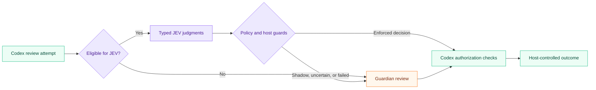

<div align="center">

# JEV × Codex

### Typed judgments. Explicit policy. Guardian fallback.

An experimental approval preflight for Codex — built around narrow questions, deterministic decisions, and host-owned execution.

[](https://github.com/CompleteTech-LLC-AI-Research/jev-codex-approval/actions/workflows/python-tests.yml)

[](LICENSE)


[Quick start](#verify-without-credentials-or-network) · [Architecture](ARCHITECTURE.md) · [Native integration](docs/NATIVE_INTEGRATION.md) · [Security](docs/SECURITY.md) · [Validation](STATUS.md)

</div>

---

JEV supplies narrow typed judgments before an eligible Codex Guardian inference. Ordinary code combines those judgments. Codex retains responsibility for permission enforcement, action binding, cancellation, and final execution.

> [!IMPORTANT]
> **Experimental reference implementation · v0.1.0.** Python contract tests and scripted replay are available today. The native Codex adapter **has not been compiled or exercised inside a running Codex instance**. No live TypeSafe evaluation or JEV-versus-Guardian speed measurement has been performed.

## At a glance

| Typed evaluation | Explicit enforcement | Review continuity |
|---|---|---|
| Narrow questions produce structured answers validated against a strict contract. | Ordinary code combines answers with policy pins, host guards, and audit requirements. | Ineligible actions, uncertainty, and failures defer to the existing Guardian path. |

## How it fits



This is a simplified view of the proposed native integration. The [complete architecture](ARCHITECTURE.md) covers existing fast approvals, hooks, cancellation, freshness checks, and final permission enforcement.

## Start here

Read [the complete architecture](ARCHITECTURE.md), [native installation](docs/NATIVE_INTEGRATION.md), [security boundaries](docs/SECURITY.md), and [validation status](STATUS.md). All diagrams are editable Mermaid source; the principal diagram is embedded in the architecture document.

The package contains the executable Python policy engine, the documented TypeSafe HTTP contract, a localhost service, a guarded native-source installer, an abstaining hook-compatibility adapter, reproducible tests, benchmark fixtures, calibration tooling, configuration examples, operational instructions, and provenance references.

## Verify without credentials or network

Clone the repository and enter the project directory:

```sh
git clone https://github.com/CompleteTech-LLC-AI-Research/jev-codex-approval.git
cd jev-codex-approval
```

Then, with Python 3.11 or newer, run the offline checks:

```sh
python -m unittest discover -s tests -t . -v
python benchmarks/run.py
python -m jev_approval questions
```

No package installation is required for these commands. Runtime dependencies are Python standard-library modules. Optional installation is `python -m pip install .`; installing build dependencies can require network access, unlike running the source tree.

`benchmarks/run.py` defaults to **scripted fixture responses**, not real JEV inference. Its 24-case replay tests routing behavior and does not measure semantic accuracy or establish production thresholds.

## Native integration

The installer targets only `openai/codex` commit:

```text
c45ea25ffb72d5f7324489d824d0c677283aa0b4
```

It verifies HEAD and the two original file blobs, shows the complete diff, and refuses a changed source tree. It changes `guardian/mod.rs`, wraps the original inference call in `guardian/review_request.rs`, and adds `guardian/jev.rs`. No remote repository is modified.

```sh
python scripts/install_native.py --repo /absolute/path/to/pinned/codex > native-review.diff
# Review the diff, then apply deliberately:
python scripts/install_native.py --repo /absolute/path/to/pinned/codex --apply
```

Native build and tests must pass before enabling the integration. Follow the pinned repository's `AGENTS.md`: use its `just` recipes, including the scoped `codex-core` tests. See [the native guide](docs/NATIVE_INTEGRATION.md) for the exact launch environment and rollback process.

## Initial deployment is inert

Copy `examples/config.shadow.toml` to an absolute path outside the agent's writable workspace. Create a private audit directory, set its absolute file path, and restrict the config to its owner. Remote submission is disabled until you deliberately set `allow_remote_context = true` and provide `TYPESAFE_API_KEY` to the chosen process.

Even with credentials, `mode = "shadow"` always returns `defer`. To enforce a JEV decision, both the effective Guardian policy and the fixed question set must be explicitly hash-pinned, the action category must be enabled, all host guards must pass, the returned model must match the pinned version, and audit writing must succeed. The example thresholds are **unvalidated starting hypotheses**.

## Supported scope

| Component | Implemented behavior |
|---|---|
| Native preflight | Eligible, non-escalated `exec_command` and `apply_patch` review attempts |
| Mandatory/fresh reviews, retries, escalations | Original Guardian review; no JEV substitution |
| Network, permission expansion, stdin, intercepted exec, MCP/computer use | Original native routing remains unchanged |
| Existing deterministic and Guardian V2 fast approvals | Unchanged; no added JEV round trip |
| Existing `PermissionRequest` hooks | Unchanged; optional packaged hook abstains |
| Uncertain or failed JEV result | Defer to existing Guardian behavior |
| Model-proposed denial | Optional, disabled by default; requires established policy violation |
| Persistent service | Authenticated loopback only, bounded handlers, shared circuit breaker |
| Approval cache | No new cross-request approval cache |
| Evaluation | Offline fixtures, opt-in live classifier replay, paired comparison, threshold proposals |

## Repository layout

```text
jev-codex-approval/
  ARCHITECTURE.md                  Complete design and principal Mermaid
  STATUS.md                       Verified results and remaining gates
  jev_approval/                   Engine, API, schemas, audit, daemon, CLI
  adapters/codex-native/          Native Rust module and source pin manifest
  scripts/                       Launchers and guarded source/hook installers
  examples/                      TOML, API payloads and normalized envelope
  docs/                          Integration, operations, security and sources
  docs/diagrams/                  Three editable Mermaid diagrams
  tests/                         Offline unit and local-transport tests
  benchmarks/                    Replay, paired comparison and calibration
  reports/                       Actual test/replay results from this build
  .github/workflows/              Python CI workflow
```

## Important distinctions

The localhost daemon is **not a locally hosted JEV model**: live classification still uses TypeSafe's hosted API. A `confidence` field is not a measured probability that an approval is correct. The sample hook is not equivalent to native integration. A model timeout does not automatically authorize a user fallback; Codex's existing policy determines the outcome. Sources and inspected interfaces are recorded in [SOURCES.md](docs/SOURCES.md).

## Explore the documentation

| Guide | What you will find |
|---|---|
| [Architecture](ARCHITECTURE.md) | Decision flow, typed contracts, and trust boundaries |
| [Native integration](docs/NATIVE_INTEGRATION.md) | Pinned source installation, build gates, and rollback |
| [Operations](docs/OPERATIONS.md) | Configuration, service deployment, and troubleshooting |
| [Evaluation](docs/EVALUATION.md) | Fixture replay, paired comparison, and calibration limits |
| [Security](docs/SECURITY.md) | Privacy controls, failure behavior, and enforcement boundaries |
| [Validation status](STATUS.md) | Recorded evidence and remaining verification gates |

## Contributing

Start with [CONTRIBUTING.md](CONTRIBUTING.md). Routing and schema changes need focused tests; model and threshold changes need independent evaluation. Keep failure paths abstaining and benchmark claims tied to measured evidence.

## License

Released under the [MIT License](LICENSE). See [NOTICE](NOTICE) for project notices.
